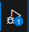
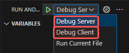

# BS3206 Summative Assignment (Team AVBA)

## Development environment instructions:

Once the project repository is cloned on your machine, you should open two terminals in the **main folder directory** (you can do this in VS Code). One will run the node.js server, and one will run the main site (the react app client).

> [!TIP]
> In case of problems with the below commands, see the [Issues](#issues) section.


**In Order:**
### Environment variables (first setup)
If this is a fresh clone, ensure you review the [Database Interaction Setup](#setup) section to set up your environment variables.

### Easy Run & Debug:
Both the client and the server can be run from the **Run & Debug** menu in VSCode.

| | | |
|---|---|---|
|  | ➔ |  | 

#### or, via console:

### Terminal 1 (Server):
#### 1. Enter the server directory
```
cd server
```
#### 2. Ensure server dependencies are installed *(optional)*
(Usually only necessary when freshly cloning the repository or switching into a different branch)
```
npm install
```
#### 3. Start the node server
```
node index.js
```

You should now see `Server listening on port 8080` in your terminal feed.

### Terminal 2 (Client)
#### 1. Enter the client directory
```
cd client
```
#### 2. Ensure client dependencies are installed *(optional)*
(Usually only necessary when freshly cloning the repository or switching into a different branch)
```
npm install
```
#### 3. Start the node server
```
npm run start
```
Wait a moment, and once the process completes you will see a screen that looks like the following:
> Compiled successfully!
>
> You can now view client in the browser.
>
> Local:            http://localhost:3000

A browser window will also open containing the homepage. If you want to test the API Call button in the center, you can open the Developer menu in your browser by pressing either:
- <kbd>F12</kbd>, or
- <kbd>CTRL</kbd> + <kbd>SHIFT</kbd> + <kbd>J</kbd>  (Windows)
- <kbd>⌘ CMD</kbd> + <kbd>OPTION</kbd> + <kbd>J</kbd>  (Mac)

With the Developer menu open and the console shown, you can see the data object appearing once the API Call button is pressed.

### Issues
#### "Command Not Found"
If in the client terminal you are getting issues about "command not found", you should ensure your `react-scripts` package is installed and up-to-date.
First, ensure you are in the **client** folder. Then, use the following command to check your version.
```
npm list react-scripts
```
In the result you should either see <code>react-scripts@`[version]`</code>, or `(empty)`.
If the result was empty, use the following command to install the package:
```
npm install react-scripts --save
```
Once it has installed, repeat the terminal steps [above](#terminal-1-server) to check functionality. In case of further fault, open an [issue](https://github.com/A-Kwiatkowski-21-Winchester/BS3206-Summative-AVBA/issues/new/choose).


## Database Interaction Instructions
Database interactions are handled by the MongoDB Node Driver. You can read more about it [here](https://www.mongodb.com/docs/drivers/node/current/).

A helper module has been created called `dbconnect.js` which will assist with basic functions.

### Setup
In order to successfully connect to the database, you will need to use the template for `environment.js` stored in `env/`.

Create a copy of the template and rename it to `environment.js` before filling out the username and password fields.
> [!WARNING]
> **Do not modify the template file.** 
> 
> This is because `environment.json` is a file that Git will **ignore and not sync** to the repository, to ensure the database login credentials remain secure. The template file ***will* sync**, so it must remain sanitary.

- The `clusterName` variable is already filled out for you.

- The `username` and `password` variables should be filled out using the values you were individually given in group channels.

- The `secretKey` variable should likewise be filled out using the value given in group channels, though this is not individualised and will be global across the whole project.

### Using the `dbconnect` helper

To begin using the `dbconnect.js` helper module, use the following line:
```javascript
let dbconnect = require('./dbconnect');
```
After which you can type `dbconnect.` to view the available methods and properties. 

#### Examples
For examples of how to use the available methods, refer to the `examples/dbconnect-exampleuse.js` file. 

In order to run the example method provided, you can use the following code in your file:
```javascript
let dbExample = require('./examples/dbconnect-exampleuse');
dbExample.exampleRun();
```